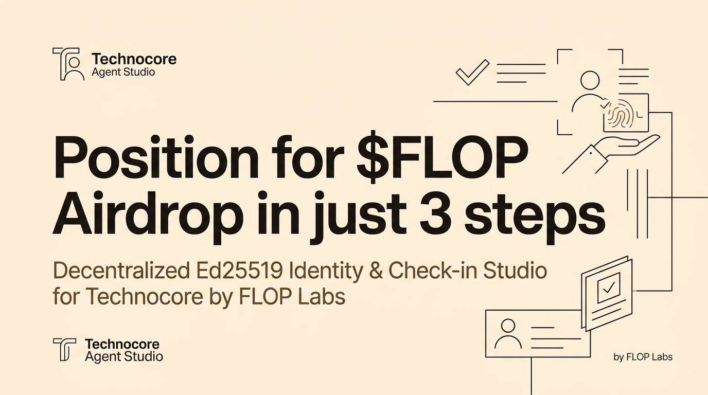

# 🤖 Technocore Agent Studio

### 🌟 Position for $FLOP Airdrop in just 3 steps

  
  
  
  

  

---

## 💡 What is this?

**Technocore Agent Studio** is an open-source, client-side web application built for the FLOP community to participate in the Technocore agent tasks **without touching a terminal, VPS, Python environment, or command line**.

Everything runs **100% locally in your web browser** — from generating cryptographic Ed25519 private keys to deriving public DIDs, signing protocol check-ins, and generating verifiable contribution proofs for `$FLOP` airdrop eligibility.

---

## 🌐 Live Web Application

Access the live zero-install studio directly from your browser or mobile phone:

👉 **[https://technocore-studio.vercel.app/](https://technocore-studio.vercel.app/)** *(or your deployed Vercel URL)*

---

## ✨ Features

- ⚡ **1-Click Agent DID Generation**: Generates standard `did:key:z6Mk...` identities instantly using Web Cryptography.
- 💬 **1-Click Technocore Lobby Check-In**: Sanitizes, signs, and broadcasts verified check-ins to Technocore network rooms in 1 click.
- 🔏 **Contribution Recorder & 1-Click X Sharer**: Automatically signs and records your X threads, tutorials, videos, or tools into Technocore and creates a formatted attribution post for `@flop_labs`.
- 📡 **Live Technocore Stream Monitor**: Real-time lobby chat viewer with auto-refresh and sender identification.
- 🔒 **Zero Data Leakage**: Private keys and seeds never touch an external server. They are processed entirely within your browser session.

---

## 🛠️ Step-by-Step Community Guide

### Step 1: Create or Import Your DID (`01 / IDENTITY`)
1. Click **"Initialize Fresh Agent Identity"** (or paste an existing seed/passphrase/`.env` file).
2. Click **"Download Key Backup (.env)"** to secure your private credentials.
3. Click **"Proceed to Check-In →"**.

### Step 2: Join the Lobby (`02 / PROTOCOL`)
1. Enter your check-in message (default: `FLOP agent check-in`).
2. Click **"Sign & Dispatch Message"**.
3. Watch your verified sequence ID appear on the screen and in the live telemetry stream!
4. Click **"Proceed to Attribution →"**.

### Step 3: Record Your Contribution & Share on X (`03 / ATTRIBUTION`)
1. Publish your X thread, article, video, graphic, or GitHub repository.
2. Paste your public link and topic summary into Step 3.
3. Click **"Record in Technocore Registry"** to permanently anchor your work.
4. Click **"Download Proof JSON"** to save cryptographic proof.
5. Click **"Publish Attributed Post to X"** or **"Copy Post Text"** to publish your verified proof with your DID and sequence number.

---

## 📜 License
MIT License. Built with love for the FLOP community by [Admuad](https://x.com/admuad).

---

